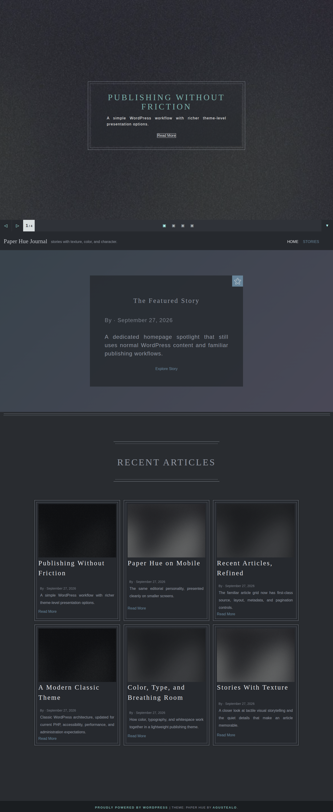
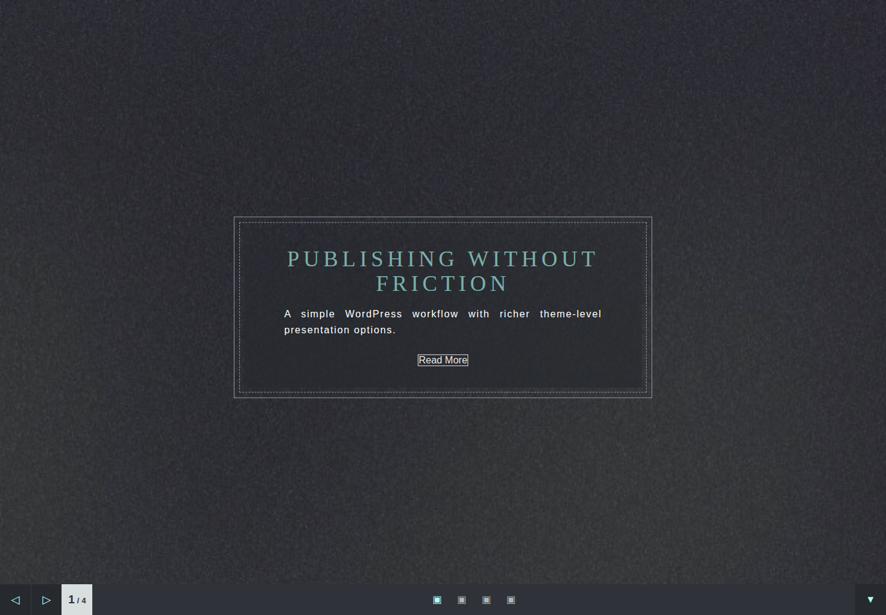
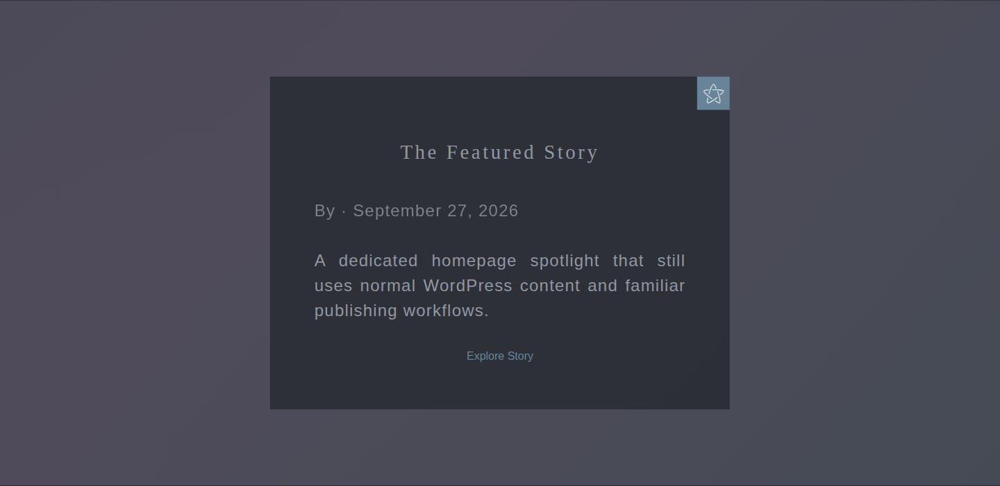
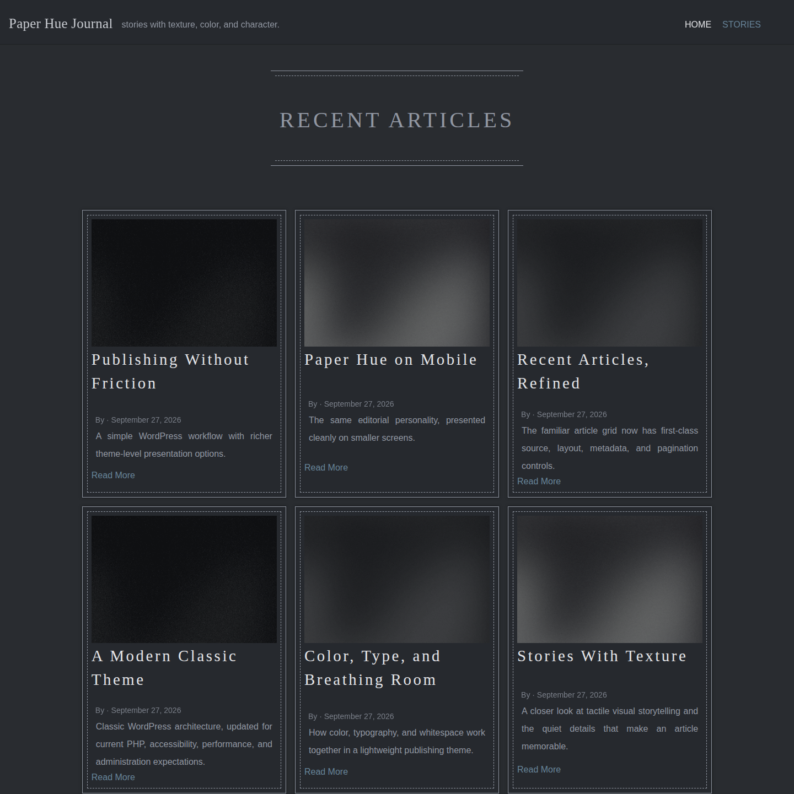
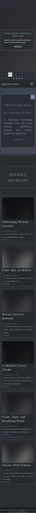
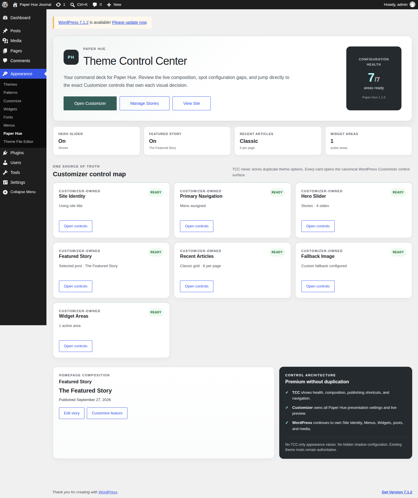
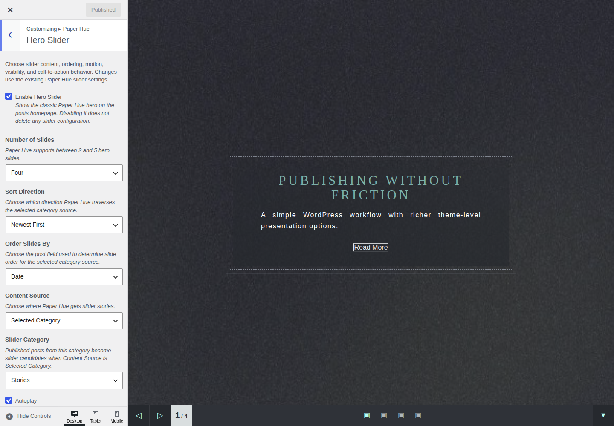
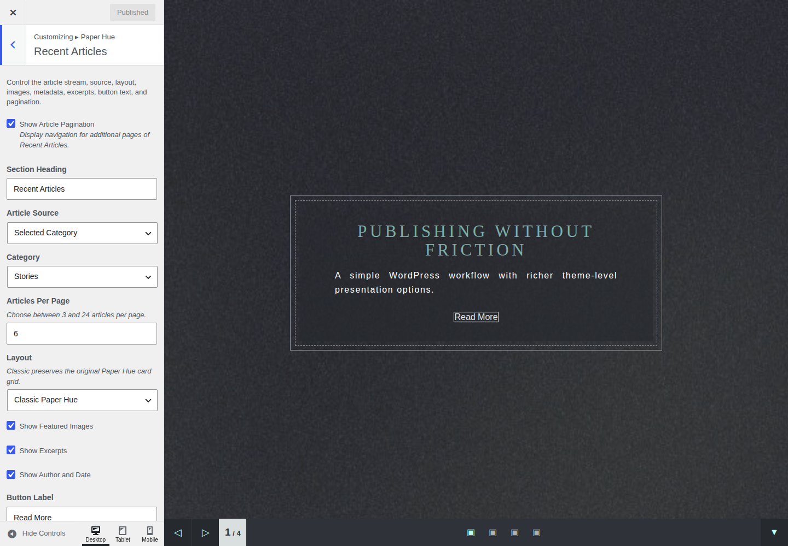
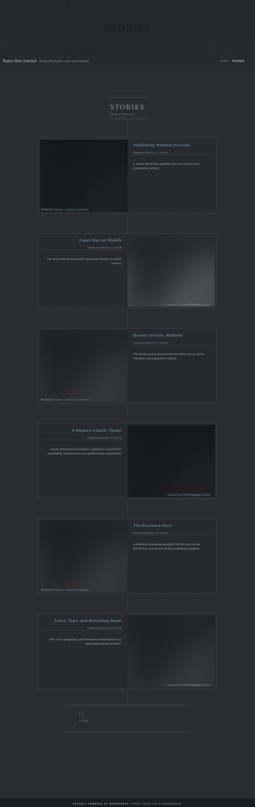

# Paper Hue

Paper Hue is a lightweight, paper-inspired **classic WordPress theme**. The 1.1 line modernizes the original 2020 theme for current WordPress and PHP without replacing its familiar templates, Customizer workflow, or visual identity.

## Compatibility

- WordPress: **6.4+**, tested through **7.1**
- PHP: **7.4+**, with the compatibility target extending through **PHP 8.5**
- Theme model: **Classic theme**
- License: **GPL-3.0-or-later**

Paper Hue intentionally remains a classic theme. This maintenance line is not a block-theme rewrite and does not require existing users to relearn the product.

## Features

- Premium **Appearance → Paper Hue Theme Control Center** for configuration health, homepage composition, publishing shortcuts, and direct navigation into the canonical WordPress controls
- Complete **Customizer-owned presentation settings** with no TCC shadow options or duplicate setting database
- First-class **Hero Slider** with category/latest/sticky sources, autoplay controls, pause-on-interaction, accessible navigation, reduced-motion behavior, CTA label, excerpt toggle, and retained legacy count/order settings
- Deliberate responsive layout transitions at desktop, tablet, mobile, and small-phone widths instead of a pile of incidental mobile overrides
- First-class **Featured Story** built on native WordPress sticky-post behavior, with optional manual/latest sources, metadata, excerpt, CTA, and Recent Articles exclusion
- Configurable **Recent Articles** source, count, section heading, classic/compact/list layouts, image/excerpt/metadata toggles, CTA label, and canonical pagination
- Configurable featured-image fallback
- Native WordPress custom-logo support while retaining the original Paper Hue logo setting only for upgraded sites that still depend on it
- Header-title, pagination, and footer controls in the Customizer
- Widget areas for post and lower-page layouts
- Jetpack and WooCommerce compatibility hooks when those plugins are active
- Translation-ready strings and standard WordPress template hooks

## Real Paper Hue gallery

These are **actual browser captures** from the governed Paper Hue presentation run. They are not mockups or reconstructed marketing images.

| Hero Slider | Desktop slider controls |
| --- | --- |
|  |  |

| Featured Story | Recent Articles |
| --- | --- |
|  |  |

| Mobile front page | Mobile slider controls |
| --- | --- |
|  |  |

| Theme Control Center | Hero Slider Customizer |
| --- | --- |
|  |  |

| Recent Articles Customizer | Category archive |
| --- | --- |
|  |  |

A real [single-post view](docs/screenshots/06-single-post.png) is included as well.

## Real browser proof

Paper Hue's 1.1 release line is exercised against a real WordPress 7.1 runtime with Playwright. The governed presentation rail captures the exact candidate SHA and includes desktop, mobile, Hero Slider, both slider-control layouts, Featured Story, Recent Articles, single-post, archive, **Appearance → Paper Hue**, and live **Customizer** control states.

The screenshot workflow deliberately rejects mock UI as release evidence. It seeds a disposable WordPress site, imports repository-owned Paper Hue imagery, configures the actual theme, captures the rendered product, asserts the Hero Slider text and controls have sane geometry, verifies the requested Customizer controls are visibly open, records runtime versions and provenance, then destroys the runtime.

The promoted screenshots come byte-for-byte from presentation candidate `6d7b0d0b86abcd7eb154ec7147d10b34267f0801`. Capture provenance is retained in [`docs/screenshots/showcase-manifest.json`](docs/screenshots/showcase-manifest.json), with the recorded candidate SHA, WordPress version, and PHP version beside it.

## Upgrade compatibility

Paper Hue 1.1 keeps the original theme-mod keys for slider, header, featured-image, front-page, logo, and footer options. Existing saved choices therefore remain available after upgrade.

The original `get_hue_image()`, `static_fallback_img()`, and `get_breadcrumb()` helpers are also retained as compatibility wrappers for child themes or custom templates that may already call them.

The theme no longer modifies submitted comment content. Older releases stripped an author's URL and lowercased comments written entirely in uppercase. Content mutation does not belong in a presentation theme, so that behavior is intentionally retired.

## Installation

1. Download or build a ZIP containing the `paper-hue` theme directory.
2. In WordPress, open **Appearance > Themes > Add New > Upload Theme**.
3. Upload the ZIP and activate Paper Hue.
4. Open **Appearance > Paper Hue** for the Theme Control Center.
5. Open **Appearance > Customize** for the canonical Hero Slider, Featured Story, Recent Articles, branding, image, header, and footer settings.

If you are upgrading an existing site, regenerating thumbnails is optional. Do it only when you want older uploads recreated for Paper Hue's registered image sizes.

## Development

Paper Hue keeps source Sass under `client-side/sass/` and the compiled production stylesheet at `client-side/css/hue-paper-style.css`. WordPress loads the compiled stylesheet directly; `style.css` remains the required theme metadata file.

The repository quality workflows syntax-check supported PHP versions, validate JavaScript, run WordPress coding/PHP compatibility standards for release candidates, build the exact distribution ZIP, and boot a real WordPress runtime for presentation proof. Changes should preserve the classic-theme UX and existing setting IDs unless a migration is included.

## 1.1 modernization highlights

The 1.1 maintenance line fixes several issues that became significant on modern WordPress/PHP installations and promotes existing Paper Hue ideas into first-class systems:

- corrects invalid post-thumbnail registration that could hard-fail under modern PHP
- fixes the bundled fallback-image filename mismatch
- adds `wp_body_open()` and a skip-to-content link
- adds sanitization to user-controlled Customizer settings
- hardens query values and output escaping
- honors the WordPress static-front-page setting
- uses WordPress's native custom-logo API while retaining the legacy logo choice for existing sites
- removes the CSS `@import` waterfall by enqueueing the compiled stylesheet directly
- replaces frozen 2015 script versions with cache-aware asset versions
- removes content-mutating comment behavior from the theme runtime
- adds a premium Paper Hue Theme Control Center without creating a parallel settings database
- makes the Customizer the complete write authority for Paper Hue presentation settings
- repairs Hero Slider text geometry and builds a contained, consistent slider control bar across desktop and mobile
- establishes deliberate responsive layout breakpoints while preserving the familiar Paper Hue desktop identity
- makes Featured Story and Recent Articles configurable while keeping original defaults familiar
- adds governed real-browser screenshot proof for public, mobile, TCC, and authenticated Customizer states

## Contributing

Pull requests are welcome. Keep changes narrowly scoped, preserve backward compatibility where practical, and avoid moving plugin-like functionality into the theme.

For large behavioral or visual changes, open an issue first so the compatibility impact can be discussed.

## Credits and license

Paper Hue is **GPL-3.0-or-later**. It is based on [Underscores](https://underscores.me/) and includes normalization work derived from [normalize.css](https://necolas.github.io/normalize.css/). See `readme.txt` and `LICENSE` for distribution details.
