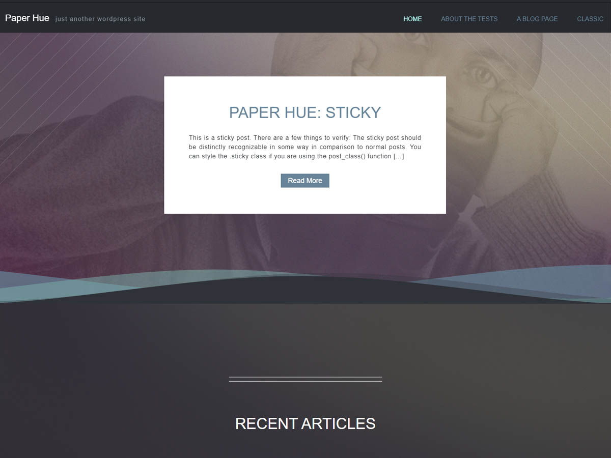

# Paper Hue

Paper Hue is a lightweight, paper-inspired **classic WordPress theme**. The 1.1 line modernizes the original 2020 theme for current WordPress and PHP without replacing its familiar templates, Customizer workflow, or visual identity.

## Compatibility

- WordPress: **6.4+**, tested through **7.1**
- PHP: **7.4+**, with the compatibility target extending through **PHP 8.5**
- Theme model: **Classic theme**
- License: **GPL-2.0-or-later**

Paper Hue intentionally remains a classic theme. This maintenance line is not a block-theme rewrite and does not require existing users to relearn the product.

## Features

- Built-in front-page slider using posts from a selected category
- Optional featured sticky post on the posts-style front page
- Configurable featured-image fallback
- Native WordPress custom-logo support while retaining the original Paper Hue logo setting for upgraded sites
- Header-title, pagination, and footer controls in the Customizer
- Widget areas for post and lower-page layouts
- Responsive front-end styles
- Jetpack and WooCommerce compatibility hooks when those plugins are active
- Translation-ready strings and standard WordPress template hooks

## Upgrade compatibility

Paper Hue 1.1 keeps the original theme-mod keys for slider, header, featured-image, front-page, logo, and footer options. Existing saved choices therefore remain available after upgrade.

The original `get_hue_image()`, `static_fallback_img()`, and `get_breadcrumb()` helpers are also retained as compatibility wrappers for child themes or custom templates that may already call them.

The theme no longer modifies submitted comment content. Older releases stripped an author's URL and lowercased comments written entirely in uppercase. Content mutation does not belong in a presentation theme, so that behavior is intentionally retired.

## Installation

1. Download or build a ZIP containing the `paper-hue` theme directory.
2. In WordPress, open **Appearance > Themes > Add New > Upload Theme**.
3. Upload the ZIP and activate Paper Hue.
4. Open **Appearance > Customize** to configure the theme.

If you are upgrading an existing site, regenerating thumbnails is optional. Do it only when you want older uploads recreated for Paper Hue's registered image sizes.

## Development

Paper Hue keeps source Sass under `client-side/sass/` and the compiled production stylesheet at `client-side/css/hue-paper-style.css`. WordPress loads the compiled stylesheet directly; `style.css` remains the required theme metadata file.

The repository quality workflow syntax-checks every PHP file against the supported PHP range and checks the repository JavaScript with Node. Changes should preserve the classic-theme UX and existing setting IDs unless a migration is included.

## 1.1 modernization highlights

The 1.1 maintenance line fixes several issues that became significant on modern WordPress/PHP installations:

- corrects invalid post-thumbnail registration that could hard-fail under modern PHP
- fixes the bundled fallback-image filename mismatch
- adds `wp_body_open()` and a skip-to-content link
- adds sanitization to user-controlled Customizer settings
- hardens slider query values and output escaping
- honors the WordPress static-front-page setting
- uses WordPress's native custom-logo API while retaining the legacy logo choice
- removes the CSS `@import` waterfall by enqueueing the compiled stylesheet directly
- replaces frozen 2015 script versions with cache-aware asset versions
- removes content-mutating comment behavior from the theme runtime

## Contributing

Pull requests are welcome. Keep changes narrowly scoped, preserve backward compatibility where practical, and avoid moving plugin-like functionality into the theme.

For large behavioral or visual changes, open an issue first so the compatibility impact can be discussed.

## Credits and license

Paper Hue is GPL-2.0-or-later. It is based on [Underscores](https://underscores.me/) and includes normalization work derived from [normalize.css](https://necolas.github.io/normalize.css/). See `readme.txt` and `LICENSE` for distribution details.
