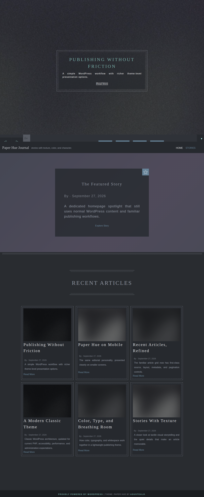
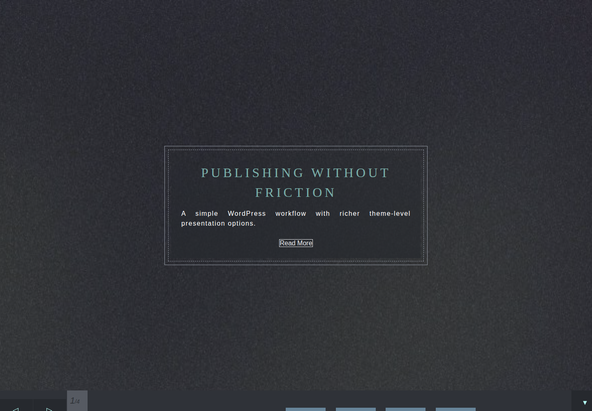
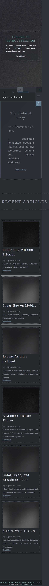
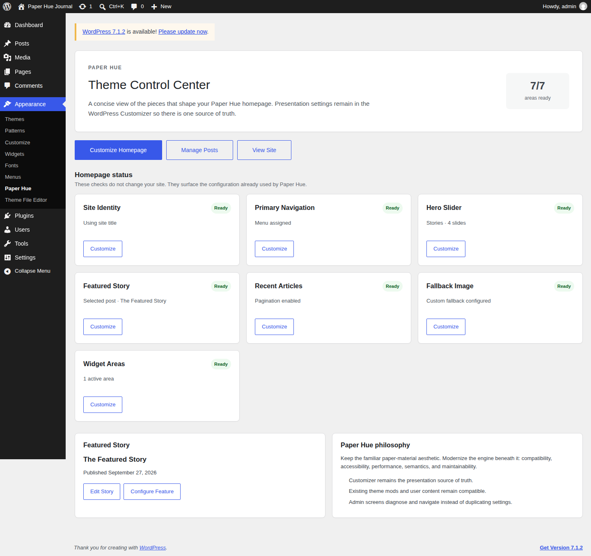
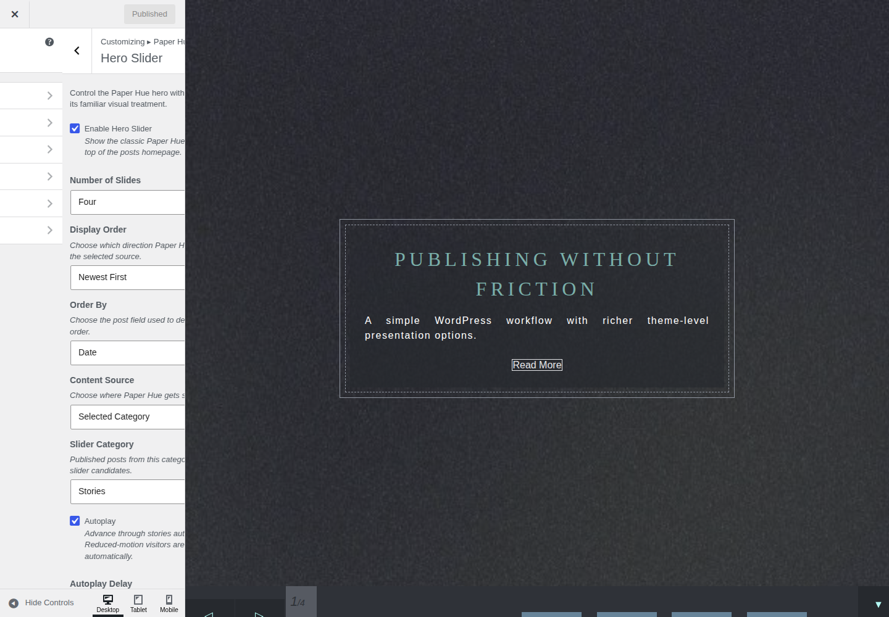

# Paper Hue 1.1 real screenshot gallery

These are real browser captures from the governed Paper Hue presentation proof, not mockups or generated UI.

- Production candidate: `master@9e8f296e461ce4006afaa4f88709e8e06d7c9d88`
- WordPress: `7.1`
- PHP: `8.3`
- Authenticated admin proof: `true`
- Hero Slider geometry guard: passed
- Source artifact: `paper-hue-real-screenshots-9e8f296e461ce4006afaa4f88709e8e06d7c9d88`
- Artifact digest: `sha256:dbbdd38d3342905c9876eba71fe4edcd5832aa9f076f7dfa1504d18cd8127304`

## Desktop homepage

## Hero Slider

## Mobile homepage

## Appearance → Paper Hue

## Live Customizer

